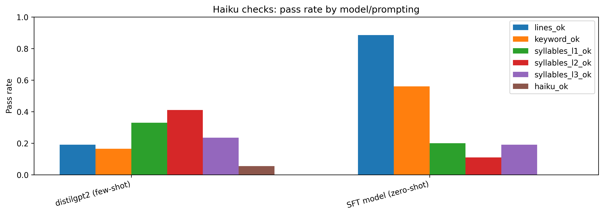

# Haiku Bot Evaluation Scoreboard

All models are evaluated on the test keyword set (particle physics) using a fixed generation configuration. For each keyword, the model generates 8 haikus which are then scored for consistency with haiku rules.

## Models on the Board

- Base (0-shot)
  DistilGPT-2 prompted only with a request to write a haiku

- Base (few-shot) 
  DistilGPT-2 with three in-context haiku examples demonstrating the desired structure

- SFT (0-shot)  
  DistilGPT-2 fine-tuned via supervised learning on the curated dataset of physics haikus, evaluated
  without any in-context examples

## Conclusions Up Front

- the zero-shot base model fails to satisfy any haiku check
- the few-shot base model gives small, non-zero pass rates for all haiku checks
- supervised fine-tuning produces a very large and consistent improvement over the few-shot base model across every haiku check
- SFT still leaves much to be desired: it doesn't get syllables perfect, none of the haikus pass all checks, and the actual haiku outputs are not of great quality

## Scoreboard

### Pass Rates by Model

| Model              | 3 Lines | Keyword | 1st Syll | 2nd Syll | 3rd Syll | Haiku pass |
|--------------------|---------|---------|----------|----------|----------|------------|
| Base (0-shot)      |  0.00   |  0.00   |   0.00   |   0.00   |   0.00   |    0.00    |
| Base (few-shot)    |  0.08   |  0.03   |   0.09   |   0.01   |   0.01   |    0.00    |
| SFT (0-shot)       |  0.89   |  0.57   |   0.19   |   0.11   |   0.20   |    0.00    |

## Remarks

It's no surprise that zero-shot prompting completely fails for the base model. The few-shot model tries to mimic the example haikus, but its pass rates are quite low. This is due in part because we don't count a given line's syllable count as a 'pass' if the model verbatim copied one of the nine haiku lines it saw in its prompt. 